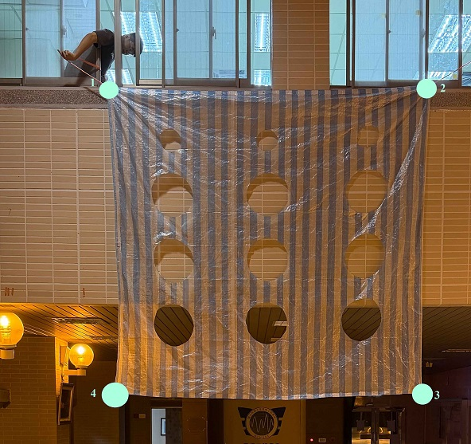

# nineGridHomography
This is a project that demonstrates the use of homography transformations on a nine-grid image. The code allows users to interactively select points on an image and apply homography transformations to warp the image accordingly.

## Features
- Interactive point selection using mouse clicks.
- Homography transformation applied to a nine-grid image.
- Visualization of the transformed image with transparency support.

## Requirements
- Python 3.x
- OpenCV
- NumPy

## Installation
1. Clone the repository:
   ```bash
   git clone https://github.com/batteryouo/nineGridHomography.git
2. Navigate to the project directory:
   ```bash
    cd nineGridHomography
3. Install the required packages:
   ```bash
    pip install -r requirements.txt
## Usage
1. Run the test script:
   ```bash
    python homography.py
    it will open two windows showing the preprocessing nine-grid image and the original image.
2. Follow the on-screen instructions to select points on the image.(The figure below shows the order of point selection)
<p align="center">
    
</p>
3. Press any key to exit the program after the transformation is applied.After the transformation, the warped image will be displayed with transparency support.
## License
This project is licensed under the MIT License. See the LICENSE file for details.